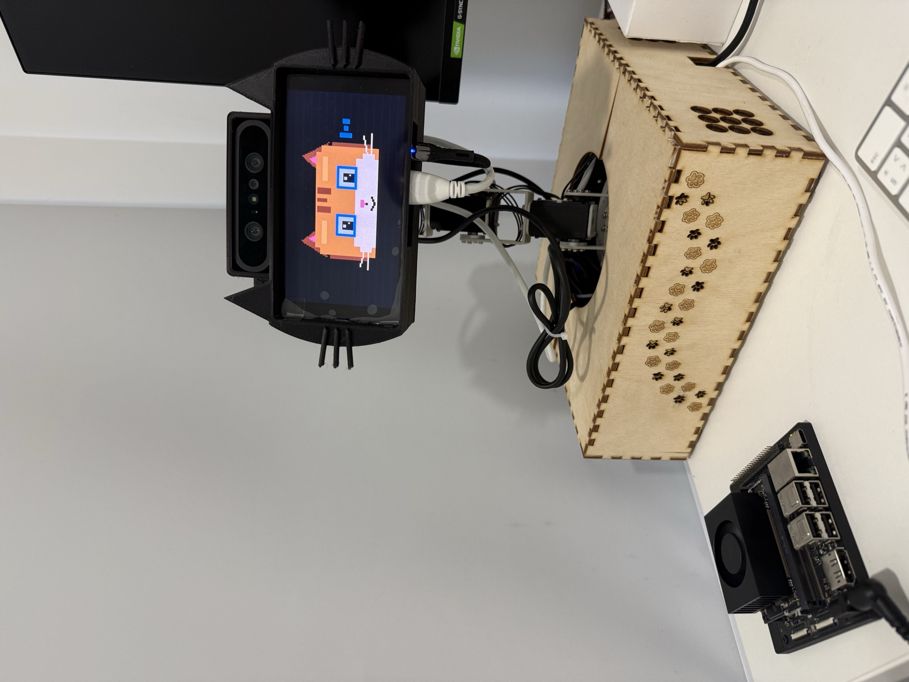
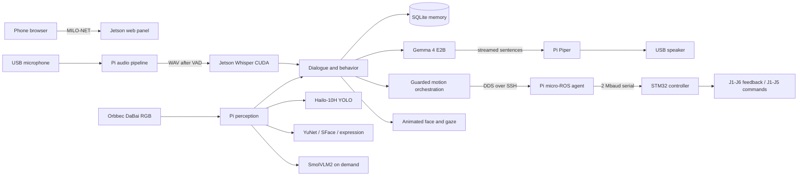

# MILO



[](https://github.com/vladromenko/MILO/actions/workflows/tests.yml)

MILO is an offline-first embodied companion robot built around an NVIDIA Jetson
Orin Nano, a Raspberry Pi 5 with a Hailo-10H accelerator, and a six-axis STM32
servo controller. It combines low-latency conversation, face tracking, object
recognition, person-scoped memory, facial-expression cues, an animated display,
and authenticated phone control.

## Demo

[](media/milo-demo-720p.mp4)

**[Watch the 4:39 final presentation](media/milo-demo-720p.mp4)**. The repository
contains a web-optimized 720p copy; the
**[1080p master is attached to the v0.1.0 release](https://github.com/vladromenko/MILO/releases/download/v0.1.0/MILO_demo_v7_corrected_story_1080p.mp4)**.

The system is intentionally split into a **brain** and an **edge/body** computer.
The Jetson keeps the language model, speech recognition, memory, policy, and
motion orchestration. The Raspberry Pi owns physical I/O: camera, Hailo vision,
microphone, speaker, display, and the arm controller. The two hosts communicate
over authenticated loopback services forwarded through SSH.

> **Project status:** research prototype. The repository captures the operating
> September 2026 installation and its reproducible build inputs. A fresh-media
> commissioning must still pass the hardware acceptance checklist. It is not a
> safety-certified robot controller.

## Capabilities

- Local Gemma 4 E2B dialogue with sentence-level streaming
- CUDA-accelerated Whisper speech recognition
- Piper speech synthesis in English, Russian, French, German, Japanese, Arabic,
  and Urdu
- YuNet face detection, SFace opt-in recognition, and scoped SQLite memory
- Approximate facial-expression cues with explicit uncertainty handling
- Hailo-accelerated COCO object detection and horizontal object search
- On-demand SmolVLM2 scene questions without blocking ordinary dialogue
- Face tracking and manual J1-J5 control; MILO never commands J6
- Offline `MILO-NET` access point and authenticated mobile control panel
- Explicit startup and shutdown from the phone; boot alone does not move the arm

## System Overview



See [Architecture](docs/ARCHITECTURE.md) for the complete process, data, and
startup flows.

## Hardware

The validated installation uses:

- NVIDIA Jetson Orin Nano, 8 GB
- Raspberry Pi 5 with AI HAT+ 2 / Hailo-10H, 8 GB accelerator memory
- Orbbec DaBai RGB/depth camera; MILO currently consumes RGB only
- Waveshare 1080x1920 HDMI display, rotated 90 degrees
- UM02 USB microphone and UACDemo USB speaker
- Yahboom M3Pro six-axis arm with STM32H743 controller and CP2104 USB-UART
- Ethernet for administration and a dedicated 2.4 GHz robot Wi-Fi network

Exact interfaces, software versions, power boundaries, and cable ownership are
listed in [Hardware](docs/HARDWARE.md).

## Quick Start

The complete fresh-install procedure is in [Installation](docs/INSTALLATION.md).
After both hosts have been commissioned, connect a phone to `MILO-NET`, open
`http://10.42.0.1/`, enter the access code, and press **Start MILO**.

The same lifecycle is available from Jetson:

```bash
ssh milo-jetson
cd /home/vlad/MILO
./milo status
./milo start          # services, startup pose, then face tracking
./milo start --no-home
./milo stop
```

Boot starts only the phone panel and network infrastructure. It does not start
conversation, restore the arm pose, or enable tracking.

## Measured Performance

All figures below were measured on the documented hardware. They are not vendor
claims and should not be extrapolated to other power modes or model builds.

| Metric | Initial implementation | Current implementation |
| --- | ---: | ---: |
| LLM time to first token, median | 0.463 s | 0.188 s |
| LLM complete response, median | 4.858 s | 1.814 s |
| Warm short-phrase STT | 2.27 s CPU | 0.24 s CUDA |
| Hailo YOLO inference | — | about 26 ms |
| One-frame VLM description | 32.2 s | 26-29 s |
| Warm 60 s system check | — | 60/60 samples without issues |

Full methodology, raw JSON, limitations, and reproduction commands are in
[Performance](docs/PERFORMANCE.md) and [`benchmarks/`](benchmarks/).

## Testing

```bash
python3 -m venv --system-site-packages .venv
.venv/bin/pip install -e . pytest
.venv/bin/python -m pytest -q
```

Hardware-free unit and integration tests cover dialogue routing, memory isolation,
audio buffering, vision parsing, lifecycle control, network profiles, motion
guards, and the mobile API. Hardware acceptance is deliberately separate; see
[Testing](docs/TESTING.md).

## Repository Map

```text
milo_next/       Runtime services and domain logic
web/             Mobile operator interface
scripts/         Installation, deployment, diagnostics, and benchmarks
tests/           Hardware-free test suite
arm_msgs/        ROS 2 arm message definitions
firmware/        Archived STM32 controller source and verified V4 image
config/          Public model manifest and DDS transport templates
benchmarks/      Reproducible raw latency measurements
docs/            Architecture, hardware, setup, operation, and engineering history
media/           Project photographs and future demo media
```

Models, virtual environments, runtime secrets, SSH keys, logs, recordings, and
personal memory are excluded from Git. Model downloads are pinned by SHA-256.

## Documentation

- [Architecture](docs/ARCHITECTURE.md)
- [Hardware specification](docs/HARDWARE.md)
- [Installation and first commissioning](docs/INSTALLATION.md)
- [Offline network setup](docs/NETWORKING.md)
- [Operation and phone controls](docs/OPERATION.md)
- [Tests and acceptance](docs/TESTING.md)
- [Performance and benchmarks](docs/PERFORMANCE.md)
- [Design evolution](docs/DESIGN_EVOLUTION.md)
- [Troubleshooting](docs/TROUBLESHOOTING.md)
- [Russian installation guide](docs/INSTALLATION_RU.md)

## Safety and Privacy

MILO stores no continuous audio or video. Camera frames used for visual questions
remain in bounded memory and are discarded after processing. Face enrollment and
personal facts require an explicit request. Face recognition is advisory and is
not authentication.

Software limits are not a physical safety system. Keep the arm workspace clear,
retain access to its power cutoff, and perform commissioning with an observer.

## License

MILO's original source is released under the Apache License 2.0. Bundled STM32,
CMSIS, HAL, model, and upstream build components retain their respective licenses.

---

Developed during the Innovation Workshop (IW) at the Skolkovo Institute of
Science and Technology (Skoltech). Core software, systems integration, and
hardware implementation were led by
[Vladislav Romenko](https://lms.skoltech.ru/groups/1640/users/15816), with project
contributions from [Mohamed Khalid Humaid Al Abri](https://lms.skoltech.ru/groups/1640/users/16063),
[Syed Ali](https://lms.skoltech.ru/groups/1640/users/14830),
[Bogdan Permin](https://lms.skoltech.ru/groups/1640/users/15704), and
[Anastasiia Sukhanovskaia](https://lms.skoltech.ru/groups/1640/users/15821).
