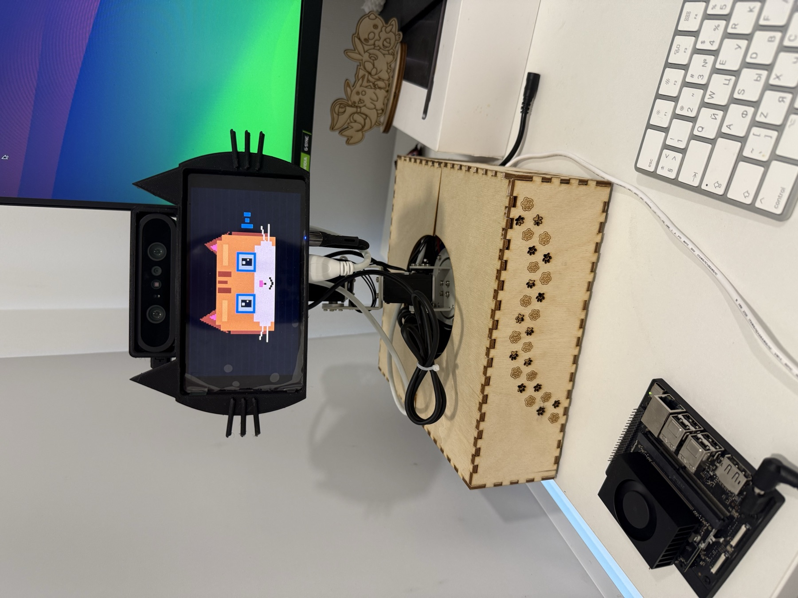

# Hardware Specification

## Validated Computers

| Role | Hardware | Validated software | Function |
| --- | --- | --- | --- |
| Brain | NVIDIA Jetson Orin Nano, 8 GB | Ubuntu 24.04, Python 3.12, ROS 2 Jazzy, CUDA 13.2 | LLM, STT, memory, policy, web, ROS publisher |
| Edge | Raspberry Pi 5 | Debian 13 arm64, Python 3.13 | Physical I/O and local perception |
| Accelerator | Raspberry Pi AI HAT+ 2, Hailo-10H | HailoRT/firmware 5.1.1 | YOLO object detection |
| Controller | STM32H743 on Yahboom M3Pro | Archived V4 micro-ROS firmware | Servo command and feedback |

The Hailo packages observed on the validated Pi were `hailo-h10-all=5.1.1`,
`hailo-tappas-core=5.1.0`, and `hailo-models=1.0.0-2`. The configured detector is
`/usr/share/hailo-models/yolov8m_h10.hef`; Hailo-8 and Hailo-8L HEFs are not
interchangeable with Hailo-10H.

## Pi Connections

| Device | Interface | Runtime owner |
| --- | --- | --- |
| Orbbec DaBai | USB, V4L2 `/dev/video0` | `milo-edge` |
| M3Pro controller CP2104 | USB serial by stable `/dev/serial/by-id/...` path | `milo-agent` |
| UM02 microphone | USB Audio Class | `milo-edge` |
| UACDemo speaker | USB Audio Class | `milo-edge` |
| Waveshare portrait display | HDMI, native 1080x1920 | `milo-edge` |
| AI HAT+ 2 | PCIe | Hailo driver and `milo-edge` |

DaBai depth data is not consumed by this release. The camera is opened as RGB
V4L2 at 640x480. A lower-cost RGB-only camera is therefore possible, but it is
not part of the validated hardware configuration.

## Jetson Connections

| Device | Interface | Purpose |
| --- | --- | --- |
| Mac administration link | Ethernet | Static 10.43.0.1/24 |
| Raspberry Pi and phone | Jetson Wi-Fi AP | `MILO-NET`, 10.42.0.0/24 |
| Optional Logitech C920 | USB | Engineering snapshot only; not required at runtime |

## Arm and Controller

The six-axis arm publishes integer joint feedback over micro-ROS. The application
uses the controller's existing V4 firmware and does not flash firmware during
normal installation.

| Joint | Application use |
| --- | --- |
| J1 | Horizontal face tracking, search, and manual control |
| J2 | Startup posture and manual control |
| J3 | Vertical face tracking, startup posture, and manual control |
| J4 | Startup posture and manual control; V4 accepts commands from 0 degrees |
| J5 | Manual control |
| J6 | Feedback only; MILO never sends J6 commands |

The repository includes the archived V4 source and verified HEX image for
recovery and audit. Flashing is a separate maintenance operation and is not part
of first installation.

## Power and Mechanical Constraints

- Power the arm from its controller supply, not from a computer USB port.
- Keep USB grounds and controller wiring in the validated configuration.
- Route display and camera cables with enough slack for the complete J1/J3 path.
- Never use software ESTOP as a substitute for a physical power cutoff.
- The screen and camera add significant load. Servo acknowledgement tolerances
  are based on measured integer feedback and are not a torque certification.
- Commission movement with a person next to the robot and a clear workspace.

## Device Discovery

Run these before editing private configuration:

```bash
ip -br link
ls -l /dev/serial/by-id/
v4l2-ctl --list-devices
arecord -l
aplay -l
wlr-randr
ls -l /dev/hailo*
```

Use stable serial by-id paths and distinctive fragments of the USB audio device
names. Do not assume `/dev/ttyUSB0` or ALSA card numbers remain stable after reboot.


